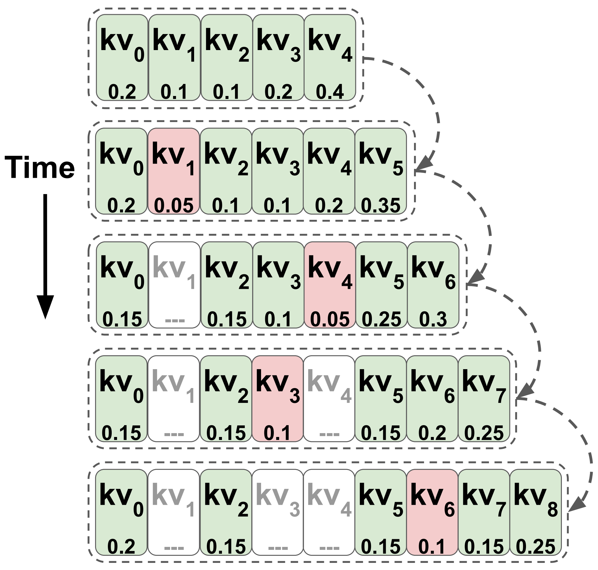

# TOVA
This repository contains the code for the paper: [Transformers are Multi-State RNNs](https://arxiv.org/abs/2401.06104) by Matenel Oren*, Michael Hassid*, Yossi Adi and Roy Schwartz.

<p align="center">
  
</p>

## How to use

First set the enviroment:
```bash
pip install transformers=4.36.2 sentencepiece
git clone https://github.com/schwartz-lab-NLP/TOVA.git
```

Next, use the following example code (currently supports LLaMA and Mistral only):
```python
from transformers import AutoTokenizer, AutoModelForCausalLM
from TOVA import TOVACache, enable_tova_caching

tokenizer = AutoTokenizer.from_pretrained("your_model")
model = AutoModelForCausalLM.from_pretrained("your_model")

prompt = "Enter your prompt here"
input_ids = tokenizer(prompt, return_tensors="pt").input_ids

# use TOVA
enable_tova_caching(model)
cache = TOVACache(multi_state_size)

output = model.generate(input_ids, past_key_values=cache)
```


## Citation
```
@misc{oren2024transformers,
title={Transformers are Multi-State {RNNs}},
author={Matanel Oren and Michael Hassid and Yossi Adi and Roy Schwartz},
year={2024},
note = {{arXiv}:2401.06104},
url = {https://arxiv.org/abs/2401.06104},
}
